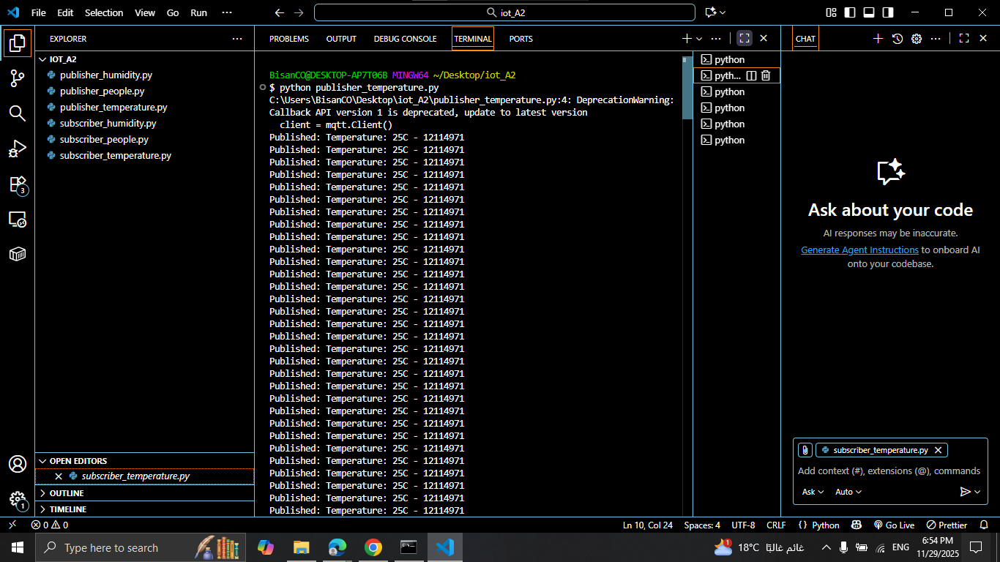
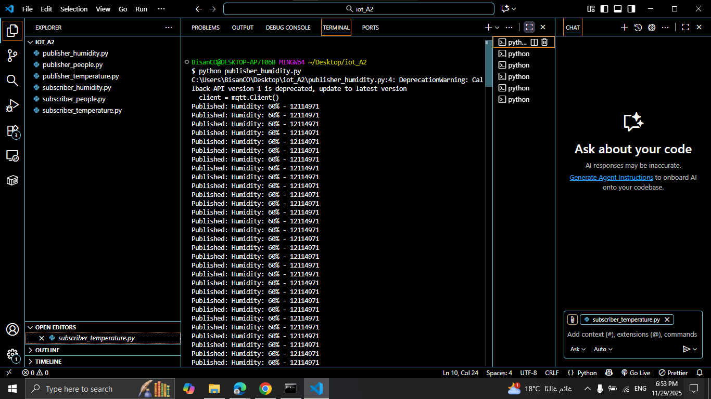
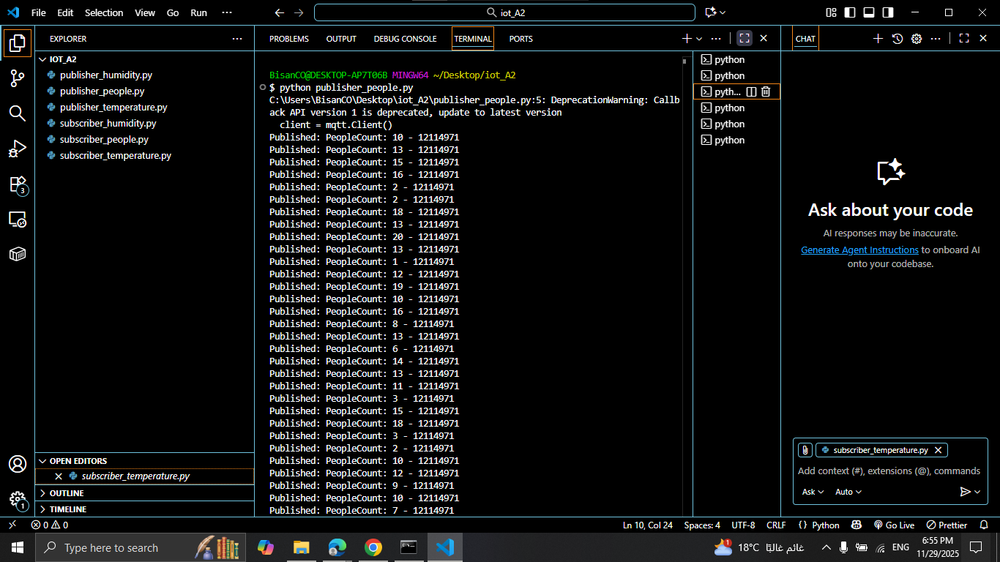
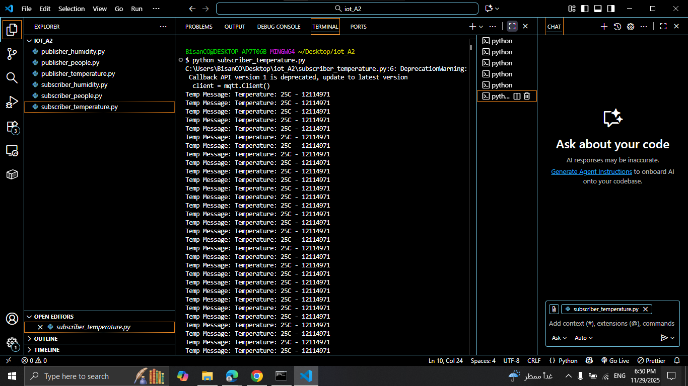
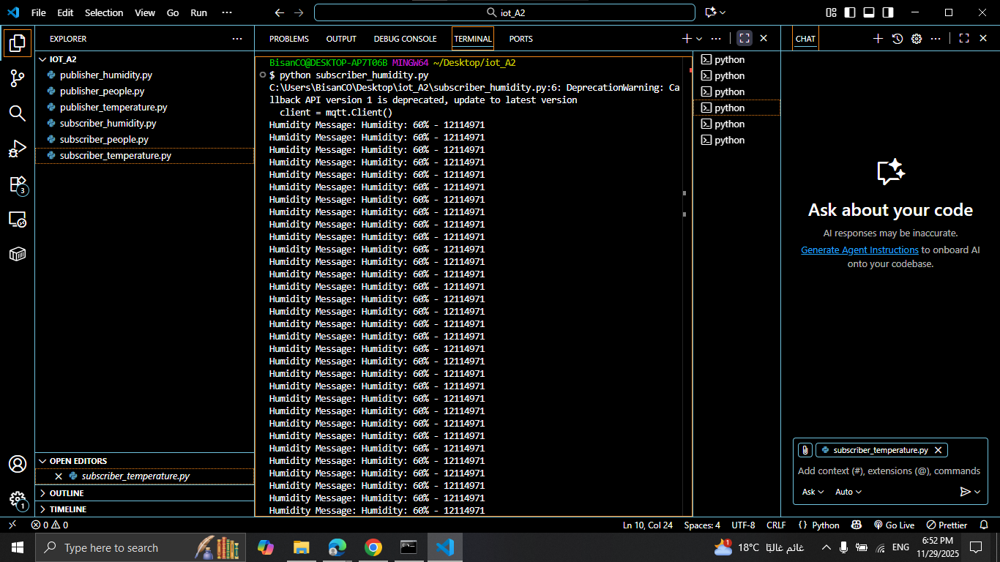
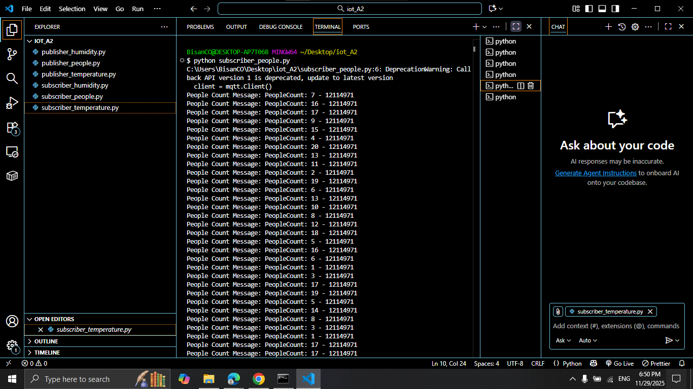

# IOT

# MQTT IoT Lab – Mosquitto + Paho MQTT

**Student Name:** Rahaf Abosefen  
**Student ID:** 12114971

---

## Overview

This lab demonstrates using the **Mosquitto MQTT broker** with multiple **publishers** and **subscribers** using the **Paho MQTT library** in Python.

You will run:

- Publishers: Temperature, Humidity, People Counter
- Subscribers: Each reads a specific topic
- Communication happens through the **public MQTT broker – broker.hivemq.com**

---

## Installation & Setup

### 1 Install Mosquitto Broker (Windows)

Download from:  
https://mosquitto.org/download/

Mosquitto default installation path:

- C:\Program Files\mosquitto

---

### 2 Install Paho MQTT for Python

```bash
pip install paho-mqtt
```

### 3 Create Publisher Files

```bash
publisher_temperature.py
publisher_humidity.py
publisher_people.py
```

##  4  Create Subscriber Files

```bash
subscriber_temperature.py
subscriber_humidity.py
subscriber_people.py
```

### MQTT Topics Used

| Sensor         | MQTT Topic        |
| -------------- | ----------------- |
| Temperature    | rahaf/temperature |
| Humidity       | rahaf/humidity    |
| People Counter | rahaf/people      |

### Running the Project

#### Run publishers (each in separate terminal):

```bash
python publisher_temperature.py
python publisher_humidity.py
python publisher_people.py
```

#### Run subscribers (each in separate terminal):

```bash
python subscriber_temperature.py
python subscriber_humidity.py
python subscriber_people.py
```

## Screenshots

### Temperature Publisher



### Humidity Publisher



### People Publisher



### Temperature Subscriber



### Humidity Subscriber



### People Subscriber


